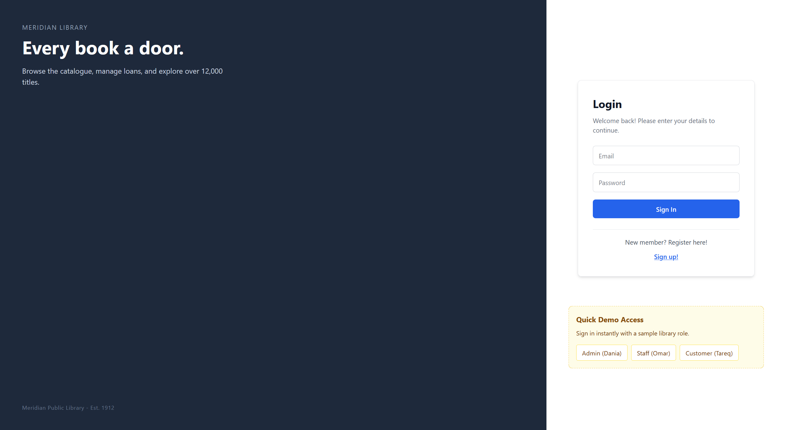
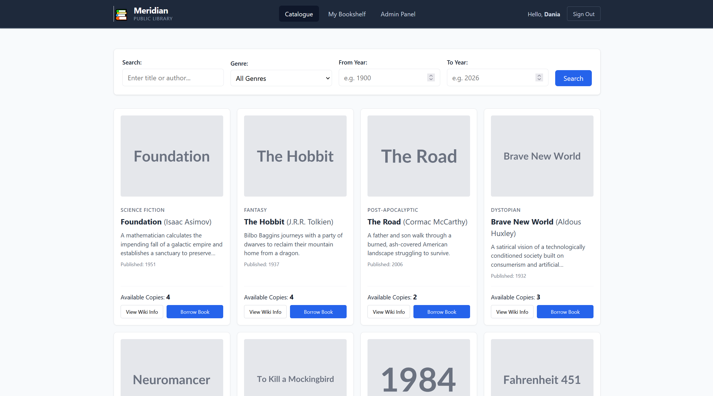
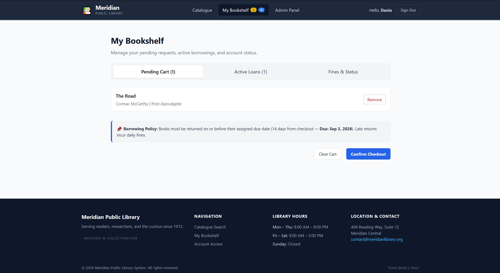
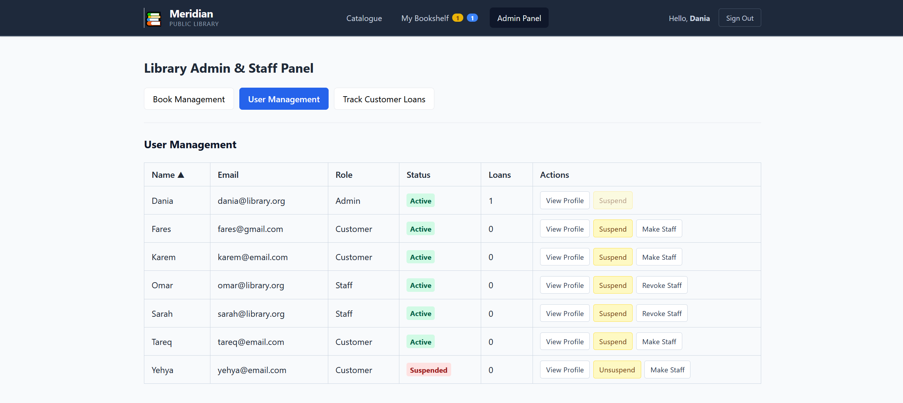

# Meridian Library System
## Updated Design Document

### 1. Project Overview
Meridian Library System is a web application that helps library members discover books, manage borrowing, and keep track of their account. Library staff can use the same system to manage books, members, and loans.

below are the images of my work.

### 2. Purpose
The system provides one simple place to:

- Browse the library catalogue
- Find books by title, author, genre, or publication year
- Create and manage a member account
- Request and check out books
- View active loans and return books
- Review and pay outstanding fines
- Manage library operations through staff tools

### 3. Main Users
**Members** can search the catalogue, add books to their cart, check out available books, return loans, and manage fines.

**Staff** can manage catalogue records, review member accounts, and track customer loans.

**Administrators** have staff permissions and can also manage staff access.

### 4. Main Features
#### Account Access
Users can register with their name, email address, password, date of birth, and a short biography. Returning users can sign in and sign out securely.

#### Book Catalogue
The catalogue displays available book records and supports filtering by:

- Title or author
- Genre
- Publication year range

Members can also open additional information about a book before deciding to borrow it.

#### My Bookshelf
The personal bookshelf brings member activity together in three areas:

- **Pending Cart:** Books selected for checkout
- **Active Loans:** Currently borrowed books and return actions
- **Fines and Status:** Account balance, borrowing restrictions, and fine payments

The system clearly warns members when an account is suspended or has an unpaid balance.

#### Staff and Admin Panel
Authorized staff can:

- Add, edit, and remove book records
- View and manage member profiles
- Suspend or restore member accounts
- Change eligible member staff permissions
- Track active and completed loans

Access to administrative tools is restricted to staff and administrators.

### 5. Typical Member Journey
1. Register or sign in.
2. Search and filter the book catalogue.
3. Add selected books to the pending cart.
4. Check out the books.
5. Monitor active loans in My Bookshelf.
6. Return books and pay any outstanding fines when needed.

### 6. Technology
The application is built with:

- React for the user interface
- Vite for development and production builds
- React Router for page navigation
- Firebase Authentication for account access
- Cloud Firestore for books, users, and loan records
- CSS for responsive page styling

### 7. Key Application Pages
- **Sign In and Registration:** Account access and new member registration
- **Catalogue:** Book search, filters, and book information
- **My Bookshelf:** Cart, loans, fines, and account status
- **Admin and Staff Panel:** Operational management tools
- **Not Found Page:** Friendly handling of invalid links

### 8. Access and Account Rules
Members cannot borrow books while their account is suspended or while an outstanding fine blocks borrowing. Staff and administrators receive additional permissions, while users cannot change their own administrative access or suspend their own account.

### 9. Current Scope
The current build focuses on the core library workflow: catalogue discovery, authenticated membership, borrowing, returns, fine handling, and staff administration. It is designed to give members and library teams a clear, shared view of library activity.
